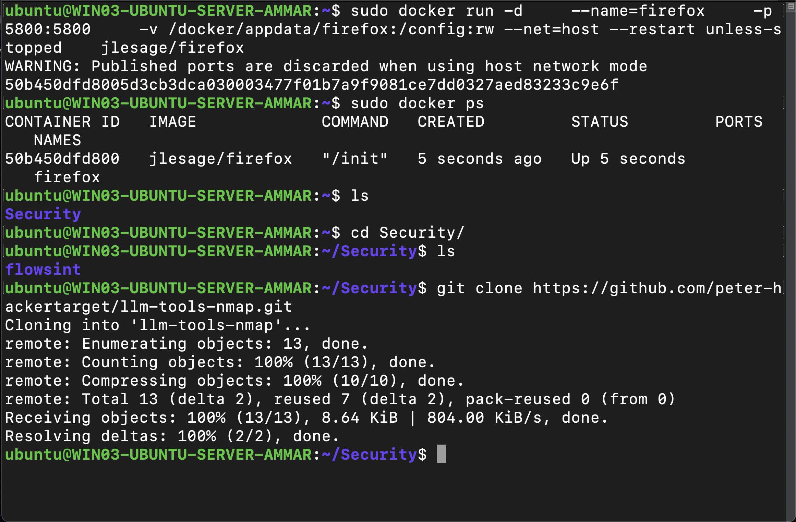
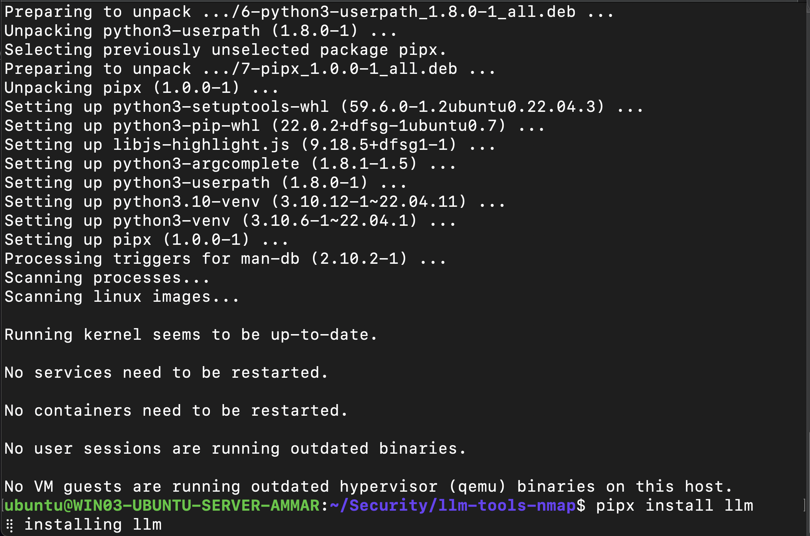
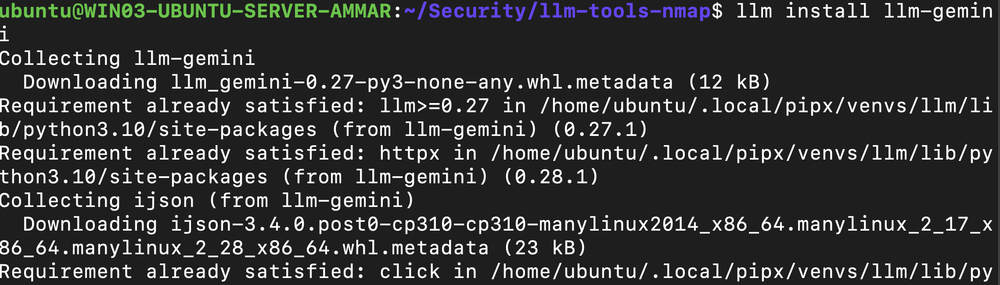
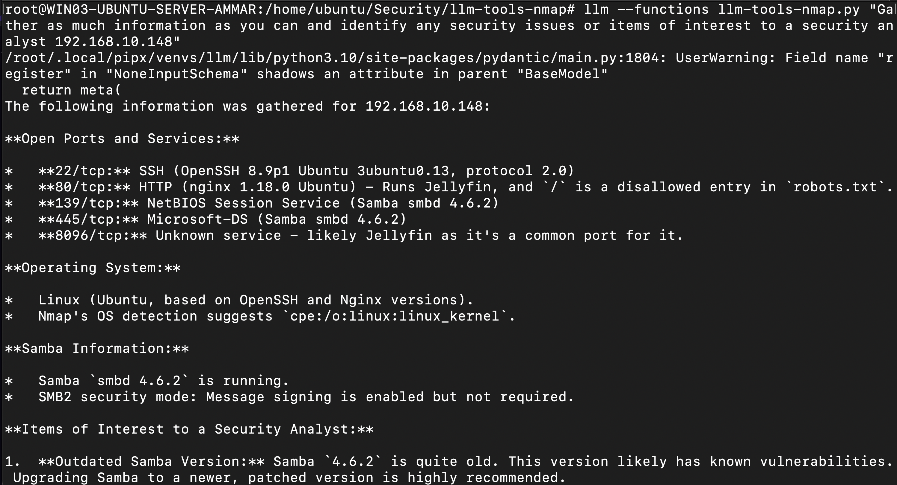

# 🤖🔍 AI-Powered Recon: Using Gemini + Nmap for Automated Security Scans

After reading the article:
https://hackers-arise.com/artificial-intelligence-in-cybersecurity-using-ai-for-port-scanning/ by @Hackers-arise which guides on how to set up a CLI LLM to conduct nmap scans using “LLM NMAP”:https://github.com/peter-hackertarget/llm-tools-nmap

I decided to give it a try, as someone who uses “nmap” for most networking and security activities I spend most of the time in the man pages for syntaxes or articles on the different scripts for Nmap Scripting Engine (NSE) for my different needs this process makes the job more simple, efficient and productive.



## 🖥️ Setup & Tools Used:
To set it up I used my ubuntu server VM 🖥️, Installed and configured “llm” python package which gives us the power to use a CLI based LLM. It was configured so that it would use “gemini-2.5-flash” with the api key from my account. Then with the cloned “LLM NMAP” from GitHub, the LLM was able to generate Nmap commands and execute them through the system, allowing automation of scanning tasks.

So to simply say the tools/resources used were:

-🔧 Pipx — python based isolation installs

-🤖 Llm — python CLI interface for LLM

-🔑 Gemini api — use gemini with “llm”

-🧩 llm-tools-nmap — llm to command nmap

-📡 nMap









## 🔎 Tests Performed

🔹 Basic Active Host Scan

Used the following prompt:

```bash
llm --functions llm-tools-nmap.py "scan this network 192.168.10.0/24 and tell me the hosts that are up with their IP"


The output was detailed, well organized, and easy to understand even though it was a CLI interface.


